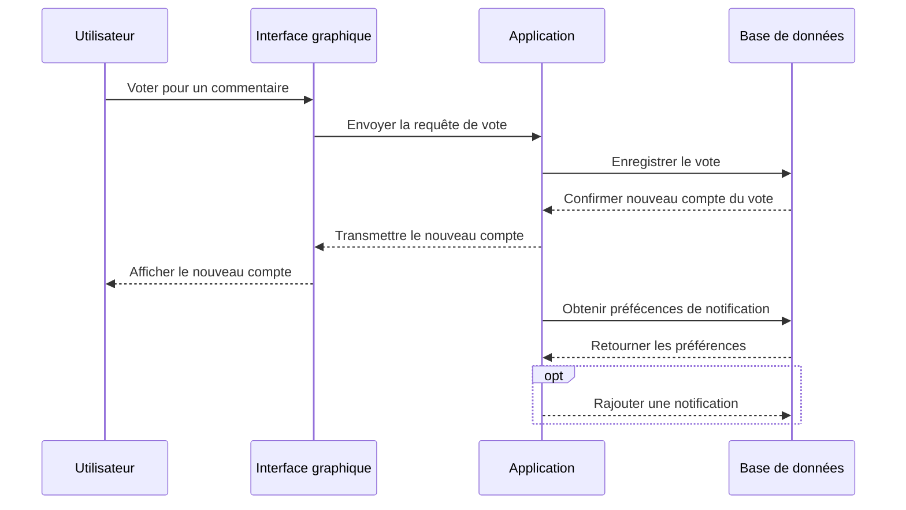
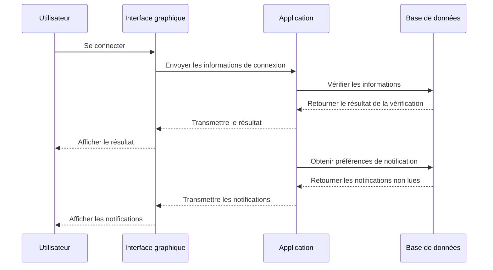

# Diagramme de séquence

Vote pour un commentaire

```mermaid
sequenceDiagram
    participant Utilisateur
    participant Interface graphique
    participant Application
    participant Base de données

    Utilisateur->>Interface graphique: Voter pour un commentaire
    Interface graphique->>Application: Envoyer la requête de vote
    Application->>Base de données: Enregistrer le vote
    Base de données-->>Application: Confirmer nouveau compte du vote
    Application-->>Interface graphique: Transmettre le nouveau compte
    Interface graphique-->>Utilisateur: Afficher le nouveau compte
    
    Application->>Base de données: Obtenir préfécences de notification
    Base de données-->>Application: Retourner les préférences

    opt
        Application-->>Base de données: Rajouter une notification
    end
```

Login et récupération des notifications

```mermaid
sequenceDiagram
    participant Utilisateur
    participant Interface graphique
    participant Application
    participant Base de données

    Utilisateur->>Interface graphique: Se connecter
    Interface graphique->>Application: Envoyer les informations de connexion
    Application->>Base de données: Vérifier les informations
    Base de données-->>Application: Retourner le résultat de la vérification
    Application-->>Interface graphique: Transmettre le résultat
    Interface graphique-->>Utilisateur: Afficher le résultat

    Application->>Base de données: Obtenir préférences de notification
    Base de données-->>Application: Retourner les notifications non lues
    Application-->>Interface graphique: Transmettre les notifications
    Interface graphique-->>Utilisateur: Afficher les notifications
```
