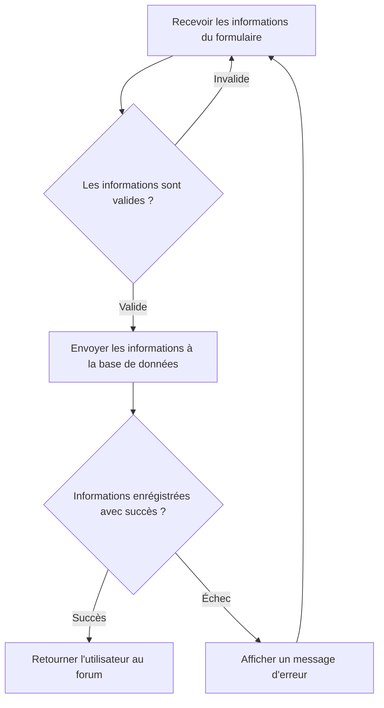

# Diagramme d'activité

Créer une publication

```mermaid
graph TD
    A["Recevoir les informations du formulaire"] --> B{"Les informations sont valides ?"}
    B --> |Invalide| A
    B --> |Valide| C["Envoyer les informations à la base de données"]
    C --> D{"Informations enrégistrées avec succès ?"}
    D -->|Succès| E["Retourner l'utilisateur au forum"]
    D -->|Échec| F["Afficher un message d'erreur"]
    F --> A
```