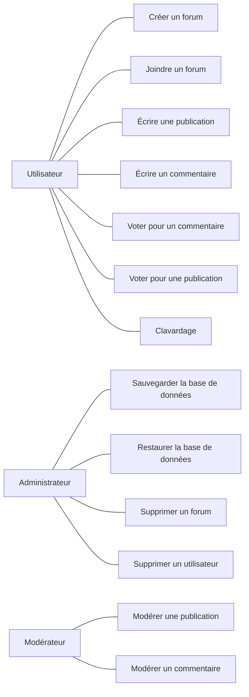

# Diagramme cas d'utilisations

Diagramme utilisateur 
-  Créer un forum
-  Joindre un forum
-  Écrire une publication
-  Écrire un commentaire
-  Voter pour un commentaire
-  Voter pour une publication
-  Clavardage

