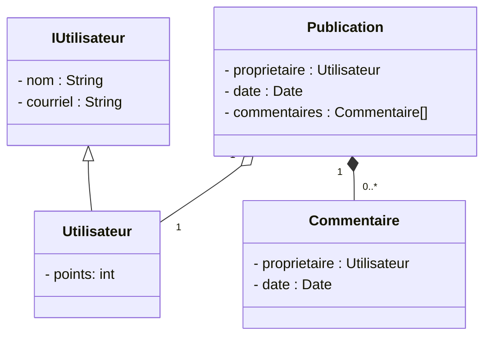

# Diagramme de classes

Classe Publication
 attribut
     - proprietaire : Utilisateur (agregation)
     - date : Date

Classe Utilisateur
 attribut
     - nom : String
     - courriel : String

```mermaid
classDiagram
    class Publication {
        - proprietaire : Utilisateur
        - date : Date
        - commentaires : Commentaire[]
    }
    class Utilisateur {
        - points: int
    }

    class Commentaire {
        - proprietaire : Utilisateur
        - date : Date
    }

    class IUtilisateur {
        - nom : String
        - courriel : String
    }

    Publication "1" o-- "1" Utilisateur
    Publication "1" *-- "0..*" Commentaire
    IUtilisateur <|-- Utilisateur

```