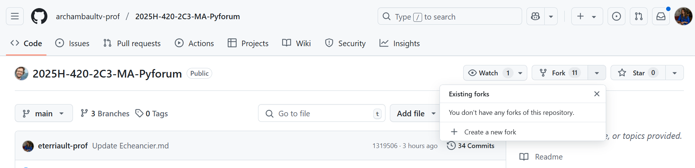
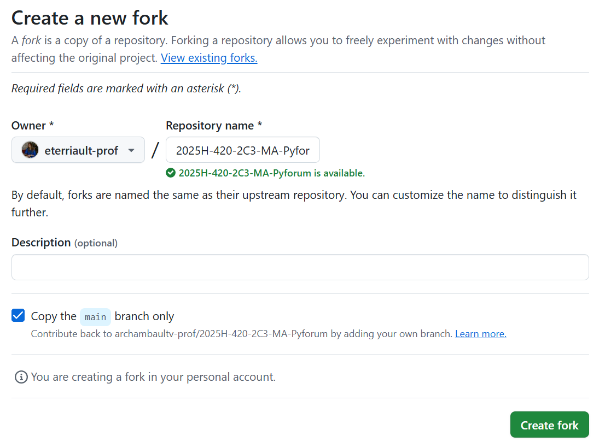
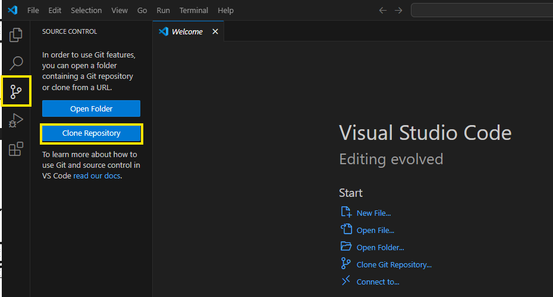
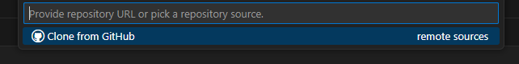
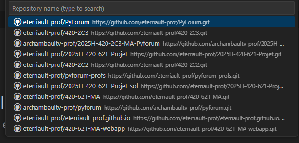

# Workflow Git suggéré

## Objectif
Vous allez créer un dépôt Git basé sur ce projet tout en conservant la possibilité de récupérer les mises à jour des nouveaux énoncés.

---

## 1. Créer votre propre dépôt sur GitHub
1. **Créez un Fork** du dépôt du professeur sur GitHub.
- Naviguez sur la page du Github du professeur, et sélectionnez *Fork* -> *Create New Fork*.

- Modifiez le nom du projet si vous le désirez, puis cliquez sur *Create fork*.

2. **Configurez votre dépôt** sur votre machine sur Visual Studio Code:
- Ouvrez Visual Studio Code, puis ouvrez la vue git à l'aide du 3e icône dans le menu à gauche, puis sélectionnez *Clone repository*.

- Dans la barre d'en haut, sélectionnez *Clone from Github*

- Sélectionnez le dépôt que vous venez de créer dans la liste déroulante.


---

## 2. Ajouter le dépôt du professeur comme remote (upstream)
Dans votre dépôt local, exécutez :
```sh
git remote add upstream <URL_DU_REPO_PROF>
```

Vérifiez que l’ajout a bien été fait :
```sh
git remote -v
```

Vous devriez voir quelque chose comme :
```
origin    <URL_DU_REPO_ETUDIANT> (fetch)
origin    <URL_DU_REPO_ETUDIANT> (push)
upstream  <URL_DU_REPO_PROF> (fetch)
upstream  <URL_DU_REPO_PROF> (push)
```

---

## 3. Récupérer les mises à jour du professeur
Lorsque de nouveaux énoncés sont publiés, suivez ces étapes pour récupérer les modifications sans écraser votre travail :

1. **Récupérer les changements du professeur** :
   ```sh
   git fetch upstream
   ```
2. **Fusionner les nouvelles mises à jour dans votre branche principale** :
   ```sh
   git merge upstream/main
   ```
3. **Pousser les changements vers votre propre dépôt** :
   ```sh
   git push origin main
   ```

---

## 4. Travailler sur votre projet
Vous pouvez maintenant modifier le code, ajouter des fichiers et committer vos modifications normalement :

```sh
git add .
git commit -m "Ajout d'une nouvelle fonctionnalité"
git push origin main
```

---